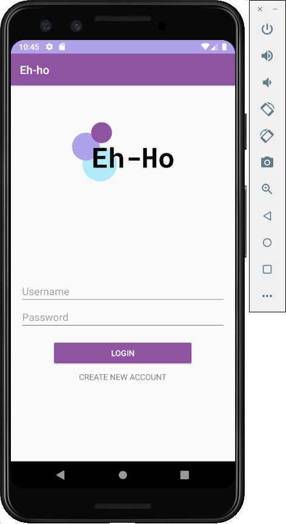
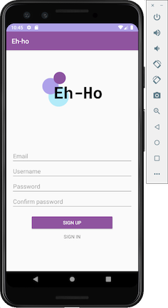
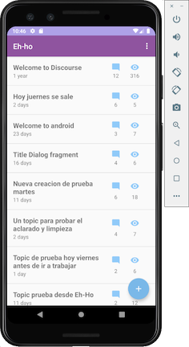
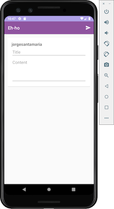
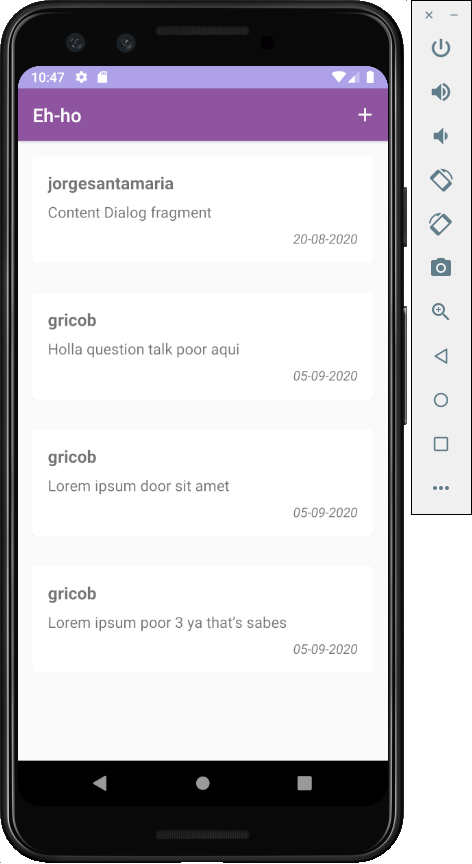
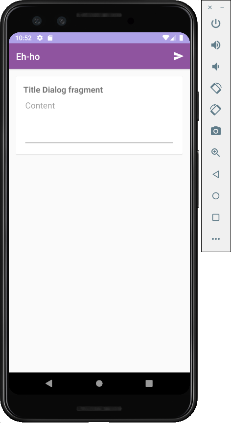

# Práctica de Fundamentos Android

Cliente Android en Kotlin para la plataforma web discourse.org

## Tecnologías

- Android Studio
- Kotlin
- Activity, Fragments, RecyclerView, Volley, Json

## Especificaciones

- Formulario de entrada para signin y signup, validando que los campos incorrectos se muestre una etiqueta de error.
- Listado de topics (petición GET)
- Creación de nuevos topics (petición POST)
- Listado de posts por topics (petición GET)
- Creación de nuevos posts (petición POST)
- ProgressBar en el listado de topics y posts
- Pull to refresh para el listado de topics y posts
- Ocultar botón de creación de tópico al hacer scroll en el listado

