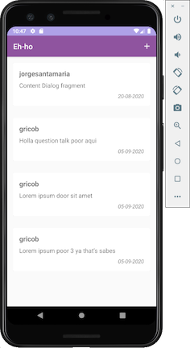

## Objetivo
Asentar los **fundamentos de Android** y **Kotlin** a partir del desarrollo de una aplicación que hará uso de los servicios que presta el API de Discourse.

- Kotlin
- Activity, Fragments
- Intent
- RecyclerView
- Volley, Json
- Android Studio
- [Discourse API](https://docs.discourse.org/)

## Especificaciones

- Formulario de entrada para signin y signup, validando que los campos incorrectos se muestre una etiqueta de error.
- Listado de topics (petición GET)
- Creación de nuevos topics (petición POST)
- Listado de posts por topics (petición GET)
- Creación de nuevos posts (petición POST)
- ProgressBar en el listado de topics y posts
- Pull to refresh para el listado de topics y posts
- Ocultar botón de creación de tópico al hacer scroll en el listado

##### Capturas de pantallas

